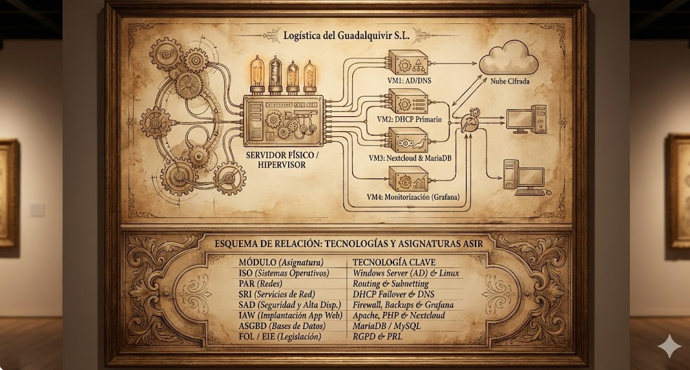

# UD1 – Análisis del entorno y detección de necesidades tecnológicas

**Alumno:** Javier Alejandro Rocha Sánchez

**Módulo:** Proyecto Intermodular (ASIR)

**Curso:** 2025/2026

  

---

## Introducción
Este repositorio contiene la documentación inicial para el diseño de una infraestructura informática segura y centralizada. El proyecto parte de un análisis del entorno tecnológico en **Sevilla (Andalucía)**, utilizando datos oficiales del *Informe del Mercado de Trabajo 2025*, y se aplica a una empresa del sector logístico en el entorno de **Coria del Río**.

## Estructura del Proyecto

1. [**Análisis del sector tecnológico**](./01_Analisis_Sector.md)
   *Datos extraídos del Informe SEPE 2025 sobre el crecimiento TIC en Sevilla.*

2. [**Selección de la empresa o contexto de trabajo**](./02_Empresa_Contexto.md)
   *Ficha de "Logística del Guadalquivir S.L." en el Polígono La Estrella.*

3. [**Identificación de necesidades tecnológicas**](./03_Necesidades.md)
   *Auditoría de carencias (Backups, Redes y Seguridad).*

4. [**Oportunidades y viabilidad del proyecto**](./04_Viabilidad.md)
   *Justificación basada en las perspectivas de empleo del sector.*

5. [**Obligaciones legales y normativas**](./05_Legal.md)
   *Cumplimiento del RGPD, LSSI y prevención de riesgos.*

6. [**Guion inicial del proyecto**](./06_Guion.md)
   *Fases de ejecución técnica y cronograma.*

